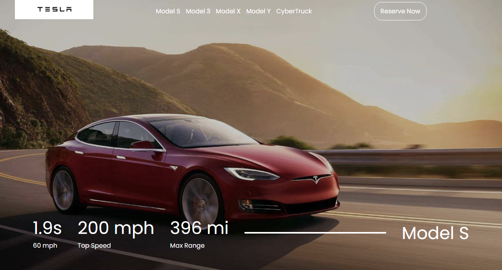

### Tesla site clone

#### Link to the live website:
[Tesla clone](https://fatscythe.github.io/Tesla-Clone/"TeslaClonelivesite")

___

#### Description : Tesla clone is a dynamic web site, it uses the DOM to change the content of the page when the links are being clicked, it is responsive
____

#### Tech Used : Html, CSS, git, github.
___

#### What i learned:
#### Using index parameter to query the objects in array, such that when a linked is clicked it change the content of the webpage

```JavaScript
const teslaCars = [
	{name: 'Model S',
	 topSpeed : 322,
	 maxRange : 350,
	 time: 2.1	
	},
	{name: 'Model 3',
	 topSpeed : 261,
	 maxRange : 285,
	 time: 3.3	
	},
	{name: 'Model X',
	 topSpeed : 262,
	 maxRange : 290,
	 time: 2.6	
	},
	{name: 'Model Y',
	 topSpeed : 250,
	 maxRange : 260,
	 time: 3.7	
	},
	{name: 'Cybertruck',
	 topSpeed : 130,
	 maxRange : 250,
	 time: 6.5	
	}
];

let carInfo = `<div>
				<h2>${teslaCars[index].time}s</h2>
				<p>0-62 mph</p>
			</div>

			<div>
				<h2>${teslaCars[index].topSpeed} mph</h2>
				<p>Top Speed</p>
			</div>

			<div>
				<h2>${teslaCars[index].maxRange} mi</h2>
				<p>Max Range</p>
			</div>

			<div class="line"></div>

			<div>
				<h2>${teslaCars[index].name}</h2>
			</div>`;
```

___

#### Design image :

#### Desktop View

___

#### Future Feature :
1. Animate numeric info
1. Change background images based on the media query using Js


#### Credits
Easy Tutorial